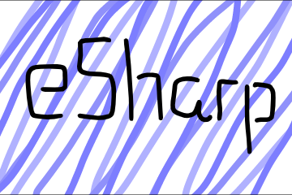

  
A easy to use html canvas based helper tool/software/game engine.
### Commands
es.random(maximum number);  
es.end();  
es.print(what is said);  
es.rect(x,y,width,height,color,opacity);   
es.eclipse(x,y,radius,color,opacity);  
es.clear();  
es.background(color);  
es.image(image,x,y,width,height,opacity);  
es.checkCollisions(x,y,width,height,x1,y1,width1,height1);  
es.text("text",x,y,color,opacity); 
es.line(x,y,x1,y1,lineWidth,color,opacity); 
##### The Opacity selector is optional
#### More things coming soon.
## Using eSharp

